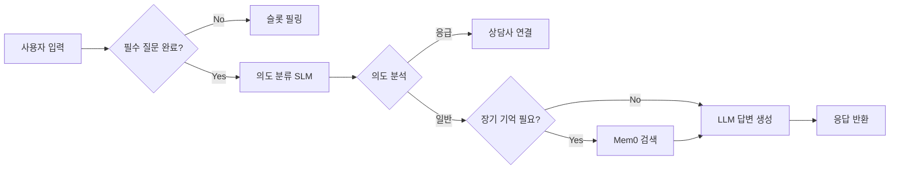

# 🌟 SilverLink-AI

**LLM 기반 콜봇·챗봇 통합 지능형 상담 AI 시스템**

독거노인을 위한 AI 기반 실시간 음성/텍스트 상담 서비스 플랫폼

## 🌐 배포 URL
**Live Demo**: [https://d1y2piyw58z1m3.cloudfront.net/](https://d1y2piyw58z1m3.cloudfront.net/)

---

## 📋 프로젝트 개요

SilverLink-AI는 독거노인의 고독과 안전 문제를 해결하기 위해 설계된 종합 케어 시스템입니다. 
AI 기반 콜봇과 챗봇을 통해 24시간 실시간 상담을 제공하며, 복지 서비스 연계, 일정 관리, 보호자 알림, 상담사 지원 등을 통합적으로 제공합니다.

### 🎯 핵심 기능
- 🤖 **AI 콜봇**: Twilio 웹소켓 기반 실시간 음성 스트리밍 상담
- 💬 **AI 챗봇**: 텍스트 기반 대화형 상담 서비스
- 🧠 **장기 기억 시스템**: Mem0 기반 사용자별 맥락 유지 및 개인화 응답
- 🚨 **응급 상황 감지**: 의도 분류를 통한 자동 상담사 연결
- 📊 **상담 기록 관리**: OCR 통한 문서 자동 분석 및 저장
- 🔄 **비동기 작업 처리**: AWS SQS 기반 고성능 메시지 큐잉

---

## 🛠️ 기술 스택

### Backend (AI Service)
- **Framework**: FastAPI (Python 3.12+)
- **LLM & AI**: OpenAI API, LangChain, LangGraph
- **Memory**: Mem0 (장기 기억), Milvus (Vector DB)
- **Communication**: Twilio (WebSocket), AWS SQS
- **DevOps**: Docker, Poetry, Pytest, Loguru

### Backend (Spring Boot)
- **Framework**: Spring Boot 3.x
- **Database**: PostgreSQL, JPA/Hibernate
- **Security**: Spring Security, JWT
- **Documentation**: Swagger/OpenAPI

### Frontend
- **Framework**: React.js with TypeScript
- **State Management**: Redux / Context API
- **UI Library**: Material-UI / Ant Design

---

## 📂 프로젝트 구조

```
SilverLink-AI/
├── app/
│   ├── api/endpoints/         # API 엔드포인트 (callbot, chatbot, ocr)
│   ├── callbot/               # 콜봇 비즈니스 로직
│   ├── chatbot/               # 챗봇 비즈니스 로직
│   ├── ocr/                   # OCR 처리 로직
│   ├── core/                  # 설정 및 컨테이너
│   ├── integration/           # 외부 API (LLM, STT, TTS)
│   ├── queue/                 # AWS SQS 워커
│   └── util/                  # 공통 유틸리티
├── evaluation/                # 성능 평가 스크립트
├── tests/                     # 유닛/통합 테스트
├── docker-compose.yml
└── pyproject.toml

SilverLink-BE/
└── src/main/java/com/aicc/silverlink/
    └── domain/
        ├── welfare/         # 복지 서비스 도메인
        ├── assignment/      # 업무 배정 도메인
        ├── guardian/        # 보호자 관리 도메인
        ├── counselor/       # 상담사 도메인
        ├── policy/          # 정책 관리 도메인
        ├── call/            # 통화 관리
        ├── chatbot/         # 챗봇 관리
        ├── audit/           # 감사 로그
        └── ...
```

---

## 🚀 주요 기능 및 아키텍처

### 1️⃣ 대화 처리 파이프라인
사용자 입력은 다음 순서로 엄격히 처리됩니다:



### 2️⃣ 비동기 작업 처리 (AWS SQS)
- **메인 큐**: 일반 작업 처리
- **DLQ (Dead Letter Queue)**: 실패한 작업 재시도 및 로깅
- **워커**: 별도 프로세스로 큐 메시지 처리 (worker_main.py)

### 3️⃣ 벡터 데이터베이스 (Milvus)
- 사용자별 대화 임베딩 저장
- 의미 기반 유사 대화 검색
- 장기 기억 컨텍스트 제공

---

## 🎨 담당 도메인 (개발 기여)

**개발 기간**: 2025.12.29 - 2026.02.09

본 프로젝트에서 다음 5개 도메인의 **전체 백엔드 API 및 비즈니스 로직**을 설계 및 구현하였습니다:

### 1. **복지 서비스 (Welfare)**
- 독거노인을 위한 정부 및 지자체 복지 서비스 정보 제공
- 서비스 신청 및 자격 조회 API
- 복지 서비스 추천 알고리즘

### 2. **업무 배정 (Assignment)**
- 상담사별 케어 대상자 자동 배정
- 업무 우선순위 관리 (긴급도, 상담 빈도 기반)
- 배정 이력 및 통계 조회

### 3. **보호자 관리 (Guardian)**
- 보호자 등록 및 정보 관리
- 이상 감지 시 보호자 자동 알림 (SMS, 푸시)
- 보호자용 대시보드 API

### 4. **상담사 관리 (Counselor)**
- 상담사 계정 및 권한 관리
- 상담 기록 조회 및 분석
- 상담사 업무 통계 대시보드

### 5. **정책 관리 (Policy)**
- 시스템 정책 설정 (응급 키워드, 응답 템플릿 등)
- 정책 버전 관리 및 롤백
- 관리자 권한 기반 정책 수정

---

## 🔧 설치 및 실행

### 1️⃣ Prerequisites
```bash
# Python 3.12+
python --version

# Poetry 설치
pip install poetry

# Docker & Docker Compose
docker --version
```

### 2️⃣ 환경 설정
```bash
# .env 파일 생성
cp .env.example .env

# 환경 변수 편집 (OpenAI API Key, AWS 자격증명 등)
vim .env
```

### 3️⃣ 의존성 설치
```bash
poetry install
```

### 4️⃣ Docker 컨테이너 실행
```bash
# Milvus, PostgreSQL 등 실행
docker-compose up -d
```

### 5️⃣ 서버 실행
```bash
# API 서버
poetry run python -m uvicorn app.main:app --reload

# SQS 워커 (별도 터미널)
poetry run python worker_main.py
```

### 6️⃣ 테스트
```bash
# 전체 테스트 실행
poetry run pytest

# 특정 테스트 실행
poetry run pytest tests/test_chatbot.py -v
```

---

## 📊 API 문서

서버 실행 후 다음 URL에서 자동 생성된 API 문서를 확인할 수 있습니다:

### 로컬 환경
- **Swagger UI**: http://localhost:8000/docs
- **ReDoc**: http://localhost:8000/redoc

### 프로덕션 환경
- **배포 URL**: https://d1y2piyw58z1m3.cloudfront.net/
- **Swagger UI**: https://d1y2piyw58z1m3.cloudfront.net/docs
- **ReDoc**: https://d1y2piyw58z1m3.cloudfront.net/redoc

### 주요 엔드포인트

| Method | Endpoint | 설명 |
|--------|----------|------|
| POST | `/api/v1/callbot/stream` | 콜봇 웹소켓 스트림 시작 |
| POST | `/api/v1/chatbot/message` | 챗봇 메시지 전송 |
| POST | `/api/v1/ocr/analyze` | 문서 OCR 분석 |
| GET | `/api/v1/welfare/services` | 복지 서비스 목록 조회 |
| POST | `/api/v1/assignment/assign` | 업무 자동 배정 |
| GET | `/api/v1/guardian/{id}` | 보호자 정보 조회 |
| PUT | `/api/v1/counselor/{id}` | 상담사 정보 수정 |
| POST | `/api/v1/policy/create` | 정책 생성 |

---

## 🧪 성능 요구사항

- **응답 속도**: 모든 API 요청은 평균 **300ms 이내** 응답
- **동시 접속**: 최소 **500명** 이상 동시 처리
- **음성 스트리밍**: 지연 시간 **100ms 이하** (Twilio WebSocket)
- **메시지 처리**: SQS 워커는 초당 **100개** 이상 메시지 처리

---

## 📈 모니터링 및 로깅

### Loguru 기반 구조화된 로깅
```python
from loguru import logger

logger.info("User message received", user_id=user_id, message=message)
logger.error("LLM API failed", error=str(e), retry_count=retry)
```

### 로그 레벨
- **DEBUG**: 개발 환경 디버깅
- **INFO**: 일반 작업 흐름
- **WARNING**: 잠재적 문제 (재시도 성공 등)
- **ERROR**: 처리 실패 (DLQ 전송 등)


---


## 🙏 감사의 말

이 프로젝트는 독거노인의 삶의 질 향상을 위해 개발되었으며, 
관련 복지 기관 및 요양 시설과의 협력을 통해 지속적으로 개선될 예정입니다.
